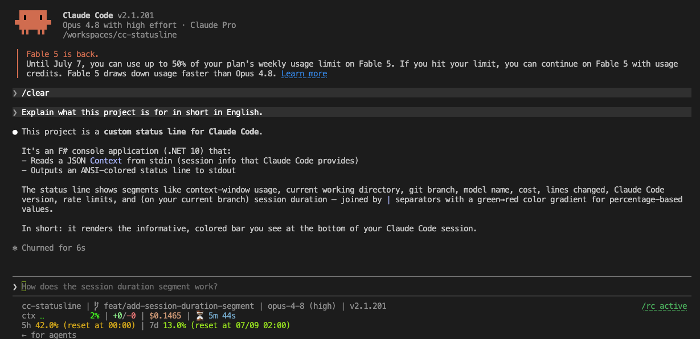

# cc-statusline

[](LICENSE)
[](https://github.com/Lightning7329/cc-statusline/releases/latest)
[](https://github.com/Lightning7329/cc-statusline/actions/workflows/ci.yml)

A custom status line for [Claude Code](https://docs.anthropic.com/en/docs/claude-code/overview). Built with F# and distributed as a self-contained single binary.

Displays context window usage, model name, session cost, rate limit status, and more — with color-coded indicators that shift from green to red as resources are consumed.



## Install

```bash
curl -fsSL https://raw.githubusercontent.com/Lightning7329/cc-statusline/main/install.sh | sh
```

This will:
1. Download the latest binary for your platform (Linux/macOS, x64/ARM64)
2. Install it to `~/.claude/bin/`
3. Configure Claude Code's `settings.json` automatically

### Options

```bash
# Install a specific version
curl -fsSL https://raw.githubusercontent.com/Lightning7329/cc-statusline/main/install.sh | sh -s -- --version v0.0.1

# Install to a custom directory
curl -fsSL https://raw.githubusercontent.com/Lightning7329/cc-statusline/main/install.sh | sh -s -- --dir /usr/local/bin

# Configure a specific settings scope (user, project, or local)
curl -fsSL https://raw.githubusercontent.com/Lightning7329/cc-statusline/main/install.sh | sh -s -- --scope project
```

### Manual setup

1. Download and extract the binary:
   ```bash
   # Using curl (replace OS and ARCH as needed: linux/osx, x64/arm64)
   curl -fsSL https://github.com/Lightning7329/cc-statusline/releases/latest/download/statusline-linux-x64.tar.gz | tar -xz

   # Or using gh CLI
   gh release download --repo Lightning7329/cc-statusline --pattern 'statusline-linux-x64.tar.gz' && tar -xzf statusline-linux-x64.tar.gz
   ```
2. Place it in your PATH:
   ```bash
   mkdir -p ~/.claude/bin
   mv statusline ~/.claude/bin/
   chmod +x ~/.claude/bin/statusline
   ```
3. Add the following to your Claude Code `settings.json`:
   ```json
   {
     "statusLine": {
       "type": "command",
       "command": "~/.claude/bin/statusline"
     }
   }
   ```

## Segments

| Segment           | Description                                                          |
| ----------------- | -------------------------------------------------------------------- |
| Working directory | Current directory, shortened with `~`                                |
| Git branch        | Current branch name, or short commit hash when in detached HEAD      |
| Model name        | Active Claude model (e.g. `opus`, `sonnet`)                          |
| Cost              | Session cost in USD                                                  |
| Context window    | Braille progress bar with usage percentage                           |
| Rate limit        | Remaining requests for context, 5-hour, and 7-day windows            |

## Requirements

- Linux (x64, ARM64) or macOS (Intel, Apple Silicon)
- Claude Code with status line support

## Development

See [docs/DEVELOPMENT.md](docs/DEVELOPMENT.md) for build instructions and local testing.

## License

[MIT License](LICENSE)
